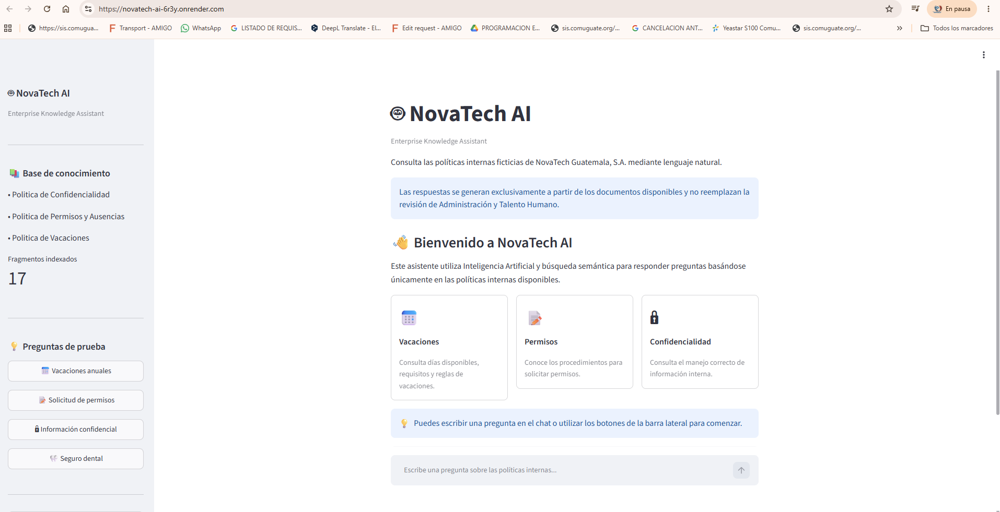
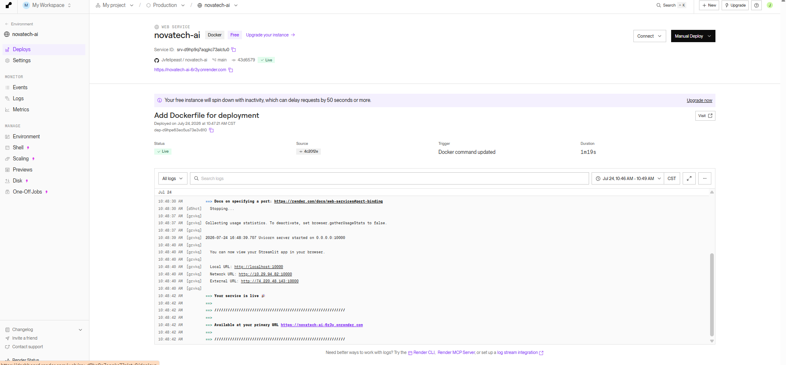

# 🤖 NovaTech AI

> **Enterprise Knowledge Assistant**

Asistente de Inteligencia Artificial basado en **Retrieval-Augmented Generation (RAG)** para consultar políticas internas mediante lenguaje natural.

> ⚠️ **Aviso:** Todos los documentos, nombres y datos incluidos en este proyecto son **ficticios** y fueron creados exclusivamente con fines educativos. No contienen información real de ninguna empresa.

---

# 📖 Descripción

NovaTech AI es un asistente empresarial desarrollado con Python que permite consultar políticas internas utilizando Inteligencia Artificial.

El sistema combina búsqueda semántica mediante **FAISS** con un modelo de lenguaje de **Google Gemini**, garantizando que las respuestas se generen únicamente a partir de la documentación disponible.

---

# 🎯 Problema

En muchas organizaciones las políticas internas están distribuidas entre múltiples documentos PDF.

Esto provoca:

- Tiempo perdido buscando información.
- Consultas repetitivas al departamento de RR. HH.
- Respuestas inconsistentes.
- Dificultad para localizar la fuente original.

---

# 💡 Solución

NovaTech AI permite realizar preguntas en lenguaje natural y responde exclusivamente utilizando la información recuperada desde la base documental.

Además, cada respuesta incluye las fuentes consultadas para facilitar la trazabilidad y transparencia.

---

# ✨ Funcionalidades

- 📄 Lectura automática de múltiples archivos PDF.
- ✂️ Fragmentación inteligente de documentos.
- 🧠 Embeddings utilizando Google Gemini.
- 🔎 Búsqueda semántica mediante FAISS.
- 🤖 Generación de respuestas con Google Gemini.
- 📚 Referencias a documentos y páginas utilizadas.
- 💬 Interfaz conversacional desarrollada con Streamlit.
- 📝 Historial de conversación.
- ⚡ Persistencia automática del índice vectorial.
- 🚫 Manejo de preguntas fuera del alcance documental.
- ⚠️ Manejo amigable de errores (API, cuota, autenticación).

---

# 🛠 Tecnologías utilizadas

- Python
- Streamlit
- LangChain
- Google Gemini API
- FAISS
- PyPDFLoader
- python-dotenv

---

# 🏗 Arquitectura

```text
                Documentos PDF
                       │
                       ▼
                 PyPDFLoader
                       │
                       ▼
             Fragmentación (Chunks)
                       │
                       ▼
                 Embeddings Gemini
                       │
                       ▼
                     FAISS
                       │
        ┌──────────────┴──────────────┐
        │                             │
        ▼                             ▼
 vector_store/                 Búsqueda Semántica
 (persistente)                       │
                                     ▼
                                Contexto RAG
                                     │
                                     ▼
                               Google Gemini
                                     │
                                     ▼
                      Respuesta + Fuentes utilizadas
```

---

# 📁 Estructura del proyecto

```text
novatech-ai/
│
├── app.py
├── README.md
├── requirements.txt
├── .gitignore
├── .env.example
│
├── data/
│   ├── Politica_de_Confidencialidad.pdf
│   ├── Politica_de_Permisos_y_Ausencias.pdf
│   └── Politica_de_Vacaciones.pdf
│
├── docs/
│   ├── AI_PROJECT_CANVAS.md
│   └── PREGUNTAS_DE_PRUEBA.md
│
├── tests/
│   └── smoke_test.py
│
└── vector_store/
    (Generado automáticamente)
```

---

# ⚙️ Requisitos

- Python 3.11 o superior
- Clave de Google Gemini API
- Conexión a Internet

---

# 🚀 Instalación

```powershell
git clone https://github.com/Jvfelipeast/novatech-ai

cd novatech-ai

python -m venv .venv

.\.venv\Scripts\activate

python -m pip install --upgrade pip

pip install -r requirements.txt
```

Crear el archivo `.env`:

```text
GOOGLE_API_KEY=TU_API_KEY
```

---

# ▶️ Ejecución

```powershell
streamlit run app.py
```

La aplicación estará disponible normalmente en:

```text
http://localhost:8501
```

---
## ☁️ Despliegue en Oracle Cloud Infrastructure

NovaTech AI será desplegado en Render utilizando un contenedor de aplicación.


### URL pública

> (https://novatech-ai-6r3y.onrender.com)

### Evidencia del despliegue

La evidencia incluirá:

- Aplicación ejecutándose en OCI.
- Dirección pública disponible.
- Consulta realizada correctamente.
- Respuesta generada con sus fuentes.

## 🧪 Ejemplos de uso

### Preguntas respondidas por la documentación

- ¿Cuántos días hábiles de vacaciones corresponden por año?
- ¿Con cuánto tiempo debo solicitar un permiso?
- ¿Qué debo hacer antes de salir de vacaciones?
- ¿Puedo colocar contratos reales en una IA pública?
- ¿Qué debo hacer si envié información al destinatario equivocado?

### Ejemplo de respuesta 1

**Pregunta:**

> ¿Cuántos días hábiles de vacaciones corresponden por año?

**Respuesta generada:**

> De acuerdo con la Política de Vacaciones de NovaTech Guatemala, los colaboradores tienen derecho a 15 días hábiles de vacaciones por cada año completo de trabajo. La programación debe coordinarse previamente con el jefe inmediato.

**Fuentes utilizadas:**

- Política de Vacaciones.
- Página correspondiente a la duración y programación de vacaciones.

### Ejemplo de respuesta 2

**Pregunta:**

> ¿Qué debo hacer si envié información al destinatario equivocado?

**Respuesta generada:**

> Debes informar inmediatamente al responsable correspondiente y seguir el procedimiento interno para incidentes de confidencialidad. También se debe evitar reenviar o continuar compartiendo la información mientras se evalúa la situación.

**Fuentes utilizadas:**

- Política de Confidencialidad.
- Sección relacionada con incidentes y divulgación no autorizada.

### Preguntas fuera del alcance documental

- ¿La empresa ofrece seguro dental?
- ¿Cuál es el salario de un analista?
- ¿Cuántos días de teletrabajo existen?

Cuando la información no aparece en los documentos, el agente responde que no encontró datos suficientes dentro de la base documental disponible.

# 📌 Decisiones técnicas

- Se utiliza búsqueda semántica para recuperar los fragmentos más relevantes.
- El modelo trabaja únicamente con el contexto recuperado (RAG).
- El prompt impide completar información utilizando conocimiento general.
- Se muestran las fuentes utilizadas para aumentar la transparencia.
- El índice FAISS se genera automáticamente la primera vez y posteriormente se reutiliza para acelerar la carga de la aplicación.

---

# ⚠️ Limitaciones

- El proyecto corresponde a un **MVP (Minimum Viable Product)**.
- Las respuestas dependen completamente de la calidad de los documentos.
- El sistema requiere conexión a Internet para utilizar Google Gemini.
- No existe autenticación de usuarios.
- No almacena conversaciones en una base de datos.
- No debe utilizarse para decisiones empresariales reales.

---

# 🚀 Próximas mejoras

- Autenticación de usuarios.
- Panel administrativo.
- Carga dinámica de nuevos documentos.
- Múltiples bases documentales.
- Integración con bases de datos.
- Evaluación automática de respuestas.
- Métricas de uso.

---

# 📸 Capturas

## 🚀 Deployment

La aplicación fue desplegada en Render utilizando Docker.

**Demo en vivo:**

https://novatech-ai-6r3y.onrender.com

### Evidencias

#### Aplicación en ejecución



#### Servicio desplegado en Render


# 👨‍💻 Autor

**Eduardo Felipe**

Proyecto desarrollado como parte del **Challenge ONE AI** de **Oracle Next Education (ONE)** y **Alura LATAM**.

---

# 📄 Licencia

Este proyecto fue desarrollado con fines exclusivamente educativos y de aprendizaje.